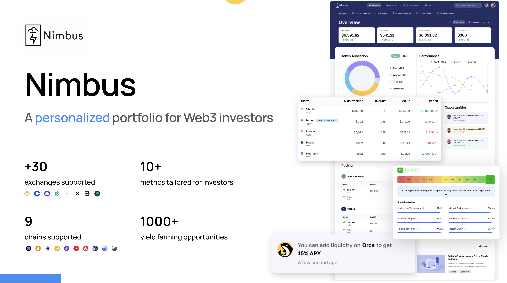

# Nimbus - A personalized portfolio tool for Web3 investors



Website: https://getnimbus.io

## ✨ USP

- 👀 **On-chain tracking**: We help you track your investment on the biggest chains like SUI, TON, Solana, Bitcoin, Ethereum, Polygon, BNB, Base,...
- 📊 **Investment metrics** (PnL, Volatility, Returns, Sharpe ratio,…): Most other tools only show what you have right now, but with Nimbus, we give you advantage analysis so you can get your PnL, portfolio volatility, Sharpe ratio, money flow,… You can understand what is going on with your investment, and what the next step to do.
- 👩‍🌾 **Yield farming suggestion**: Don’t just let your token stay the same, we turn your holding into passive income by suggesting yield farming opportunities
- 🐳 **Whale analysis**: The easiest way to gain in this market is to follow the whale, with our hand-pick whale list, you can get their insight, and then make a huge profit like them

## Project Setup

```sh
yarn install
```

## Commands

### Build

#### Development, HMR

```sh
yarn dev
```
# solana-recap
